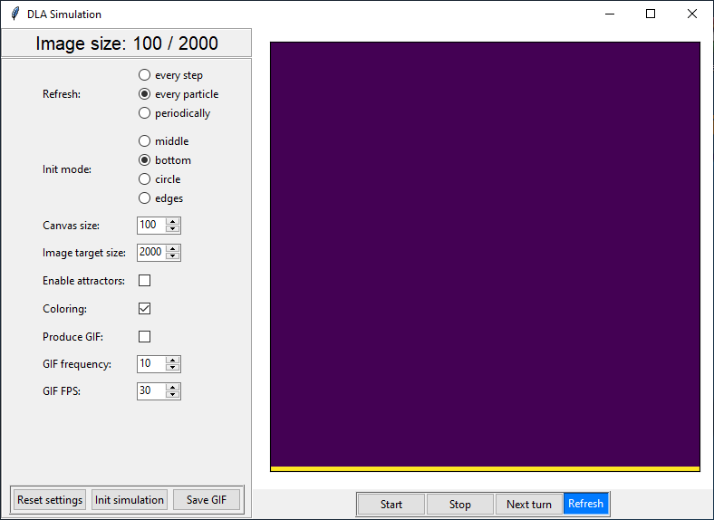
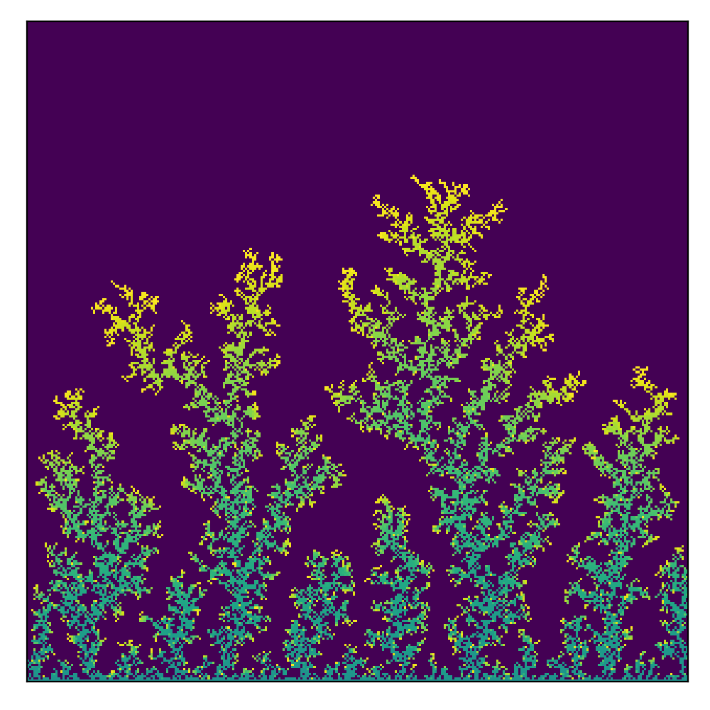
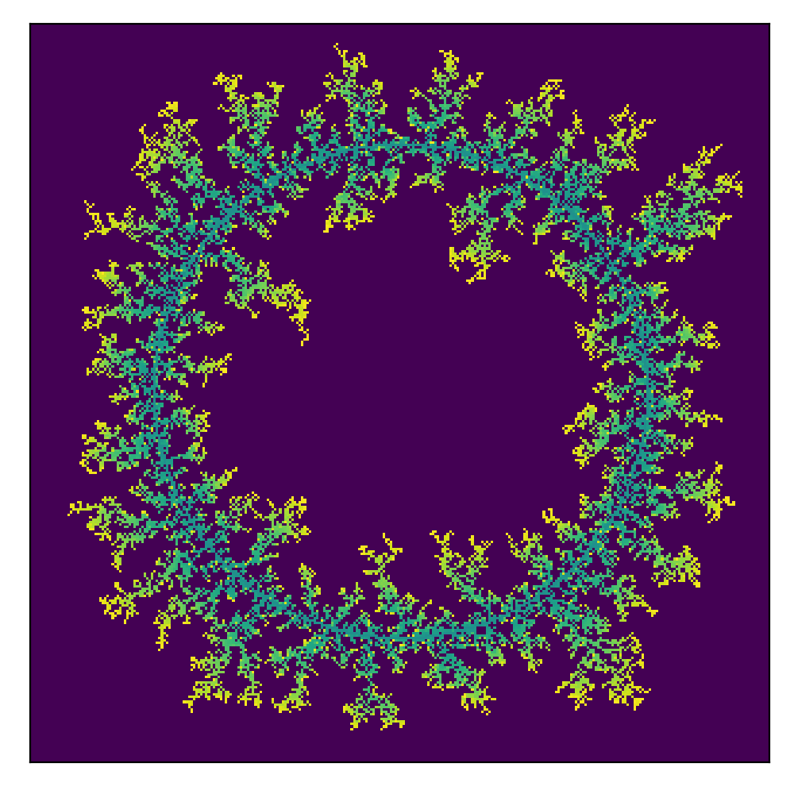
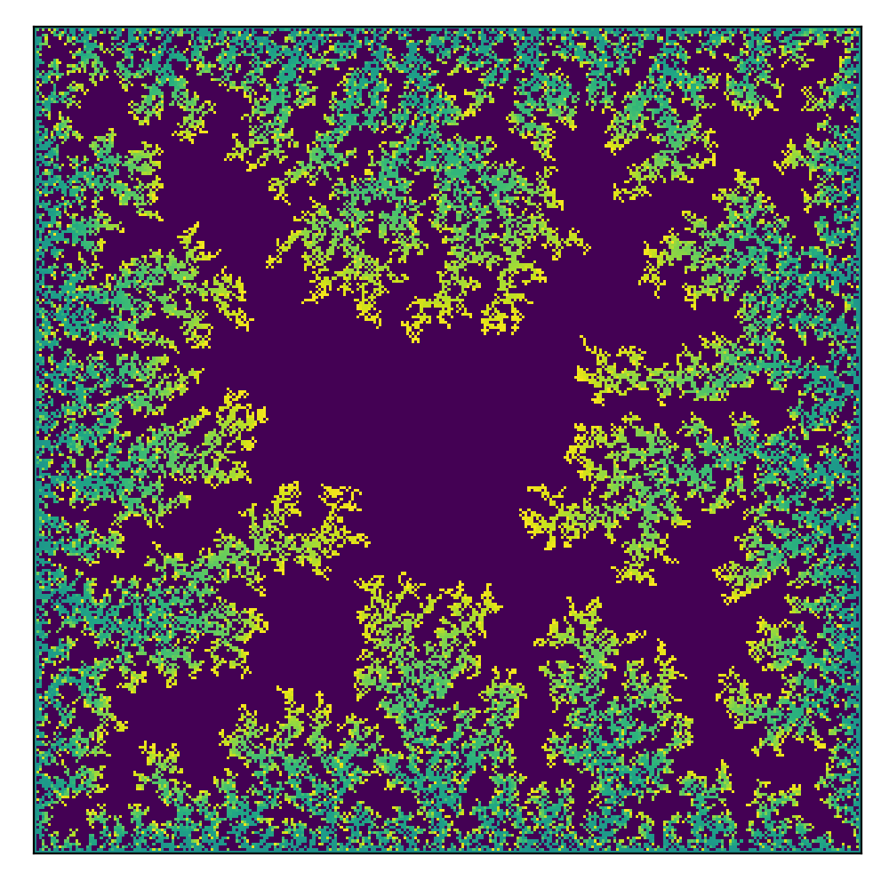

# Diffusion-Limited Aggregation simulator

## Usage
```python
python main.py
```

## GUI
<!--  -->


## Examples without attractors

### 1. Initialization: middle, 300x300, 12000 particles
  

### 2. Initialization: bottom, 300x300, 15000 particles
  

### 3. Initialization: circle, 300x300, 15000 particles
  

### 4. Initialization: edges, 300x300, 30000 particles
  

## Examples with attractors

### 1. Initialization: middle, 300x300, 
TODO

### 2. Initialization: bottom, 300x300, 
TODO

### 3. Initialization: circle, 300x300, 
TODO

### 4. Initialization: edges, 300x300, 
TODO

### 5. Other example 1, 300x300, 
TODO

### 4. Other example 2, 300x300, 
TODO