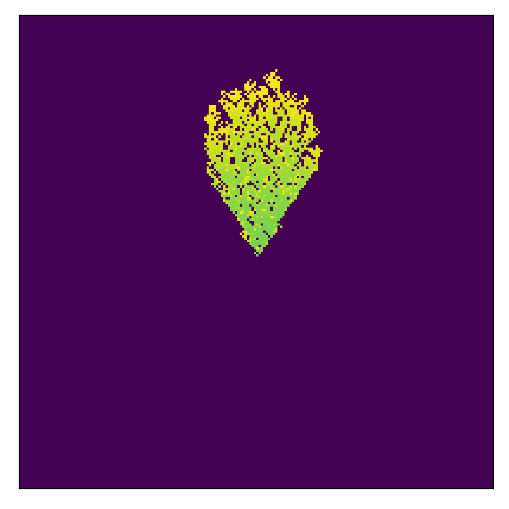
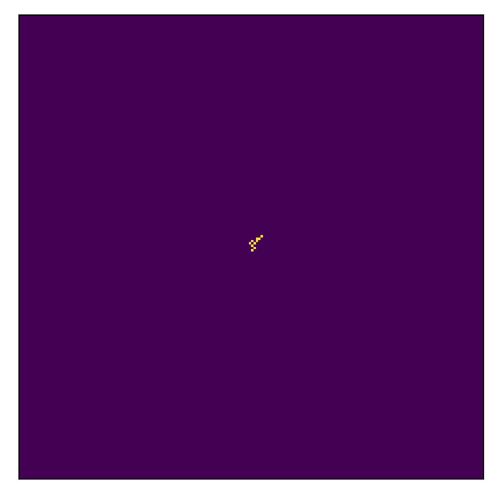
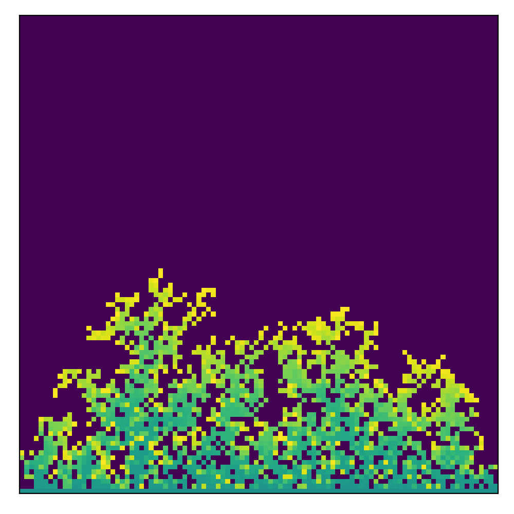
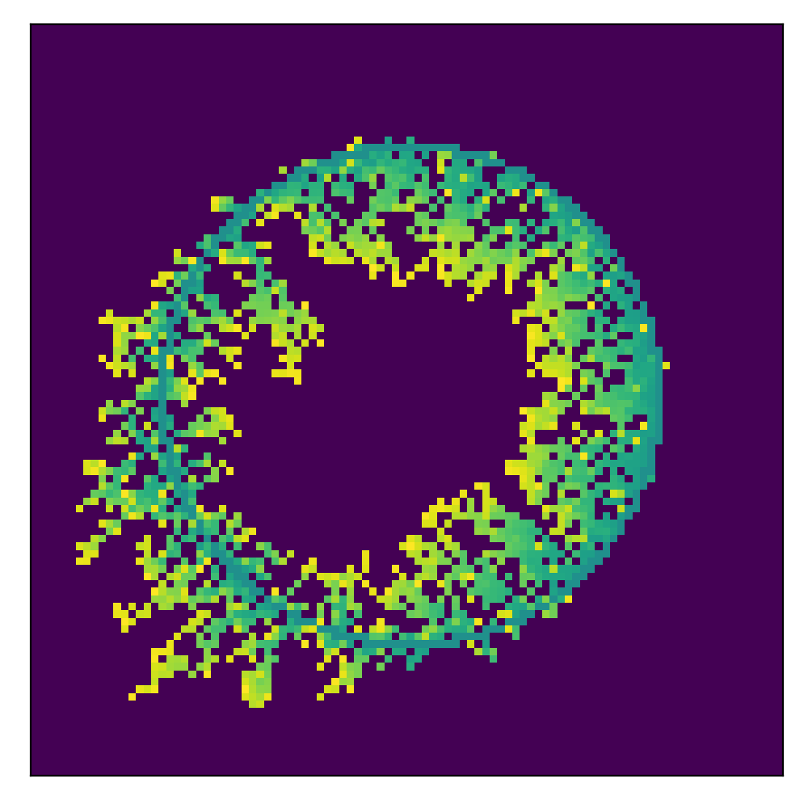
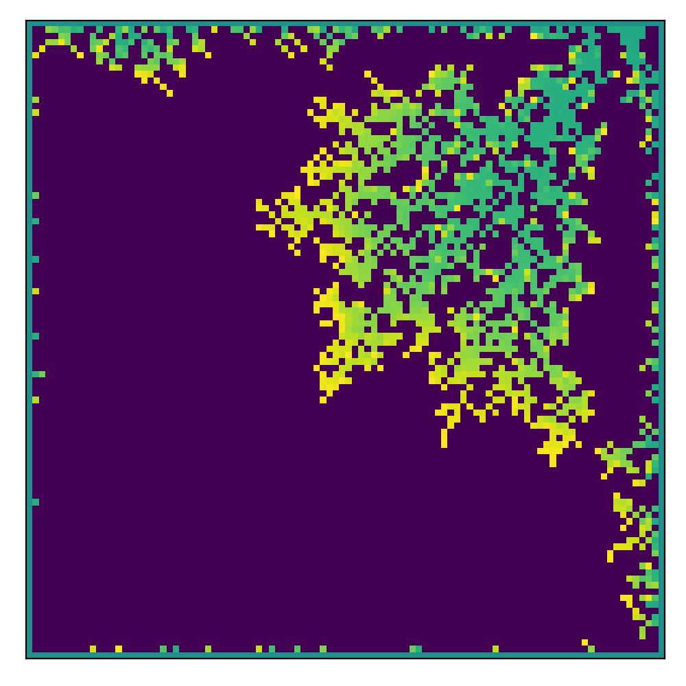

# Diffusion-Limited Aggregation simulator

## Usage
```python
python main.py
```

## GUI
<!--  -->


## Examples without attractors

### 1. Initialization: middle, 300x300, 12000 particles
  

### 2. Initialization: bottom, 300x300, 15000 particles
  

### 3. Initialization: circle, 300x300, 15000 particles
  

### 4. Initialization: edges, 300x300, 30000 particles
  

## Examples with attractors

### 1. Initialization: middle, 200x200, 7500 particles, circle negative attractor at x:0.5 y:1
  

### 2. Initialization: bottom, 100x100, 2000 particles, 3 circle negative attractors placed in pyramid shape
  

### 3. Initialization: circle, 100x100, 2000 particles, circle positive attractor at x:1 y:1
  

### 4. Initialization: edges, 100x100, 2000 particles, circle positive attractors in 3 corners
  
