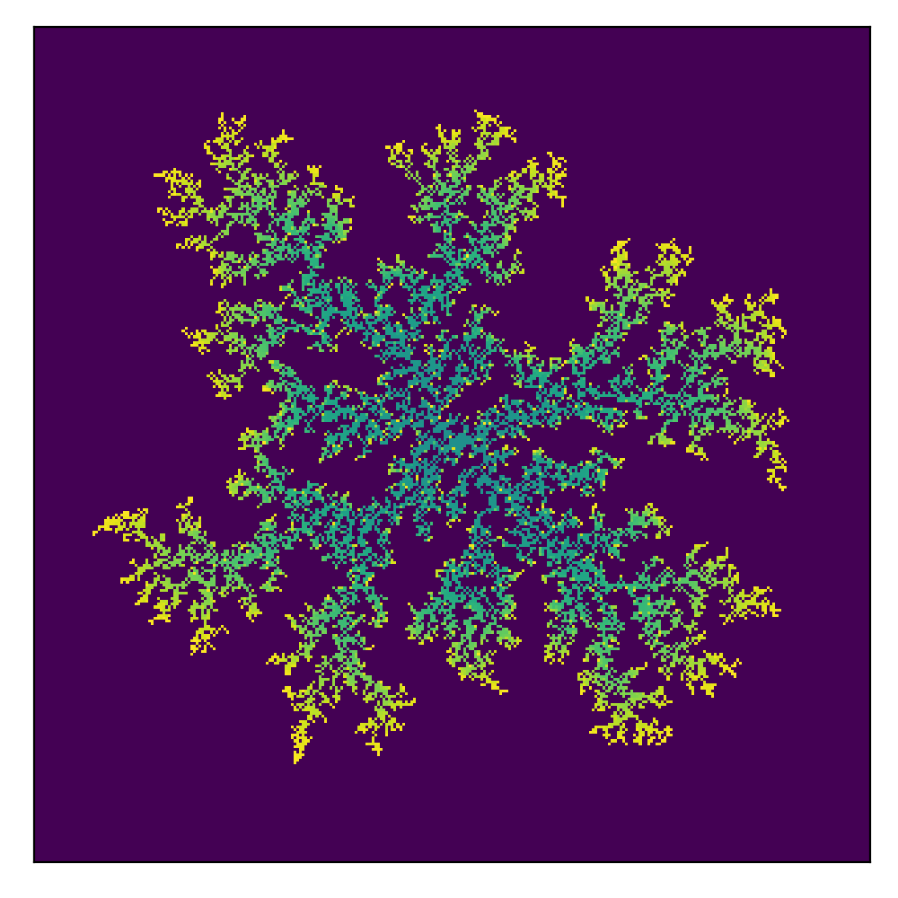

# Diffusion-Limited Aggregation simulator

## GUI
TODO

## Examples without attractors

### 1. Initialization: middle, 300x300, 12000 particles
  

### 2. Initialization: bottom, 300x300, 15000 particles
TODO

### 3. Initialization: circle, 300x300, 15000 particles
TODO

### 4. Initialization: edges, 300x300, 15000 particles
TODO

## Examples with attractors

### 1. Initialization: middle, 300x300, 
TODO

### 2. Initialization: bottom, 300x300, 
TODO

### 3. Initialization: circle, 300x300, 
TODO

### 4. Initialization: edges, 300x300, 
TODO

### 5. Other example 1, 300x300, 
TODO

### 4. Other example 2, 300x300, 
TODO